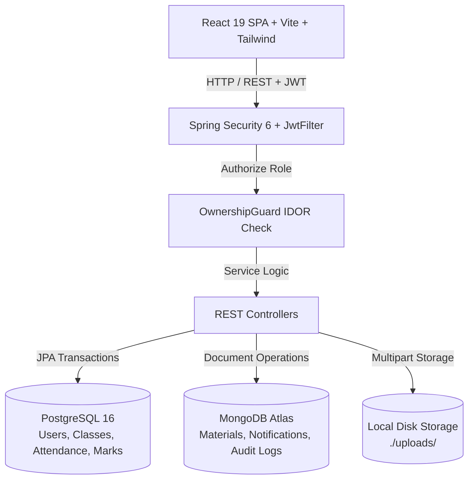

<div align="center">

  # 🎓 EduTrack — Smart School Management System
  
  **An enterprise-grade, full-stack educational management platform engineered with Java 21 (Spring Boot 3) & React 19.**

  [](https://openjdk.org/)
  [](https://spring.io/projects/spring-boot)
  [](https://react.dev/)
  [](https://tailwindcss.com/)
  [](https://www.postgresql.org/)
  [](https://www.mongodb.com/)
  [](LICENSE)

  [Features](#-key-features) • [Architecture](#-system-architecture) • [Database Design](#-database-design) • [API Specs](#-api-documentation) • [Setup Guide](#-getting-started)

</div>

---

## 📌 Executive Summary

**EduTrack** is a centralized, single-institution management system designed to streamline administrative workflows, academic evaluation, attendance tracking, and student communication. It replaces legacy manual paperwork with automated, role-based workflows, high-security server-side authorization, and an intuitive responsive user experience.

---

## ✨ Key Features

### 🌙 1. Enterprise Dark / Light Mode System
- **Context-Aware Theme Engine:** Built with persistent 3-mode selection (**Light**, **Dark**, **System Preference**) using custom CSS variables and Tailwind CSS.
- **Accessible & High Contrast:** Webkit autofill overrides and optimized color palettes to prevent eye fatigue during high-volume data entry.

### 📅 2. Excel-Based Class Attendance Management
- **Class Teacher Restriction:** Attendance uploads are restricted server-side strictly to the designated Class Teacher for each section.
- **Automated `.xlsx` Template Generator:** Class Teachers can download a pre-populated Excel template containing all assigned student Roll Numbers and Names.
- **Transaction-Safe Import Pipeline:** Uploaded sheets are parsed via Apache POI into a preview sandbox (validating duplicates, status integrity, and overwrite warnings) before batch-committing to PostgreSQL.
- **Audit Trail:** Full import history logged in MongoDB (`attendance_imports`) for compliance and auditing.

### 📝 3. Direct Student-to-Admin Change Requests
- **Direct Approval Workflow:** Students can submit profile update requests (e.g. phone, address, parent info) directly to the School Admin.
- **Bypassed Bottlenecks:** Eliminates intermediate teacher verification delays, allowing Admins to review, approve, or reject requests with instant notifications.

### 📚 4. Study Materials & Local File Storage
- **PDF-Only Document Repository:** Teachers can publish study materials and notes for specific classes and subjects.
- **Zero-Cloud Local Storage:** Engineered with a Spring Boot `FileStorageService` storing files on disk (`./uploads/`) and serving them statically over `/uploads/**`, eliminating third-party API costs.
- **Interactive PDF Preview:** Features built-in iframe PDF previewer with zoom controls, fullscreen mode, and direct download links.

---

## 🏗️ System Architecture



### Authorization & IDOR Protection Layer
Every API invocation undergoes server-side ownership verification via [`OwnershipGuard.java`](backend/src/main/java/com/edutrack/security/OwnershipGuard.java):
- **Students** can strictly view their own attendance, marks, and profile details.
- **Teachers** can only access classes, subjects, and students assigned to their teaching schedule.
- **Admins** maintain global administrative control across all resources.

---

## 🗄️ Database Design

EduTrack utilizes a **polyglot persistence model** to balance relational integrity with document flexibility:

### 1. Relational Database (PostgreSQL)
- **`users`**: Central credentials, roles (`ADMIN`, `TEACHER`, `STUDENT`), and authentication state.
- **`students`**: Personal profile, parent contact info, class mapping, roll number, and admission records.
- **`teachers`**: Designation, employee ID, qualification, and class teacher assignments.
- **`classes` & `subjects`**: Academic structure, class-subject assignments, and timetable mappings.
- **`attendance`**: Daily attendance records (`P`, `A`, `L`) normalized per student/date.
- **`change_requests`**: Profile update request pipeline (`PENDING`, `APPROVED`, `REJECTED`).

### 2. Document Database (MongoDB)
- **`study_materials`**: PDF notes metadata, category tags, file size, and upload references.
- **`attendance_imports`**: Full audit log of all raw Excel imports (confirmed or discarded).
- **`notifications`**: Real-time user notification logs.

---

## 🔌 API Documentation

| Method | Endpoint | Access | Description |
|---|---|---|---|
| `POST` | `/api/auth/login` | Public | Authenticates user and returns JWT token |
| `GET` | `/api/users/me` | Authenticated | Retrieves active user profile |
| `GET` | `/api/student/me` | `STUDENT` | Fetches complete student profile data |
| `GET` | `/api/attendance/template/{classId}` | `TEACHER` | Downloads pre-filled Excel roster template |
| `POST` | `/api/attendance/imports/preview` | `TEACHER` | Validates uploaded attendance sheet |
| `POST` | `/api/attendance/imports/{id}/confirm` | `TEACHER` | Batch commits attendance rows to PostgreSQL |
| `GET` | `/api/materials` | `STUDENT`, `TEACHER` | Lists PDF study materials for class/subject |
| `POST` | `/api/cloudinary/upload` | `TEACHER`, `ADMIN` | Stores files to local storage (`/uploads/`) |
| `GET` | `/api/admin/change-requests` | `ADMIN` | Reviews pending profile change requests |
| `POST` | `/api/admin/change-requests/{id}/review` | `ADMIN` | Approves or rejects a student change request |

---

## 💻 Getting Started

### Prerequisites
- **Java Development Kit (JDK 21+)**
- **Maven 3.8+**
- **Node.js 18+ & npm**
- **PostgreSQL 15+**
- **MongoDB 6.0+**

### 1. Backend Setup
```bash
# Clone the repository
git clone https://github.com/snehalzope2734/Edutrack.git
cd Edutrack/backend

# Configure local application settings (if Postgres password differs)
# Edit src/main/resources/application-dev.properties

# Run Spring Boot backend
mvn spring-boot:run -DskipTests
```
*The backend server will launch on `http://localhost:8080`.*

### 2. Frontend Setup
```bash
# Open a new terminal in the frontend directory
cd Edutrack/frontend

# Install dependencies
npm install

# Start Vite development server
npm run dev
```
*The React application will open on `http://localhost:5173`.*

---

## 🔑 Default Administrator Credentials

On first boot, if no `ADMIN` user exists, the application bootstraps a default administrator:
- **Email:** `admin@gmail.com`
- **Password:** `admin@123`

*Note: Please update the default password immediately after first login.*

---

## 📄 License

Distributed under the **MIT License**. See [`LICENSE`](LICENSE) for more information.

---

<div align="center">

Developed with ❤️ by **[Snehal Zope](https://github.com/snehalzope2734)**

</div>
